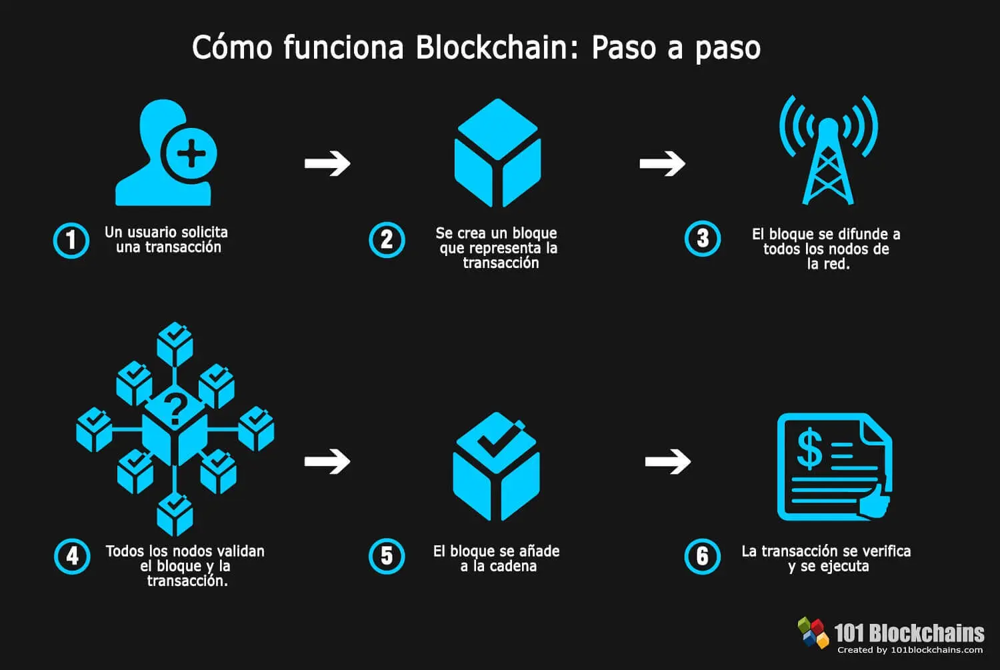
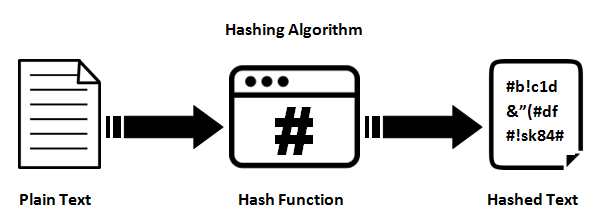

# ProyectoAED-Blockchain
## **Integrantes**
-
-
-
-

## **Introducción**
### **Blockchain**

Un Blockchian es una estructura que esta entrelazada secuencialmente mediante bloques. Cada bloque tiene un enlace criptografico con el bloque anterior, es decir que guarda la lleve de bloque anterior. Esto garantiza la seguridad de los datos y evita las manipulacion de la informacion almacenada en el Blockchian.

## **Descripción del caso de estudio planteado**

complete

## **Importancia del Blockchain en el dominio de datos elegido**

complete

## **SHA256**
El SHA256 es un algoritmo criptografico desarrollado por NSA( Agencia de Seguridad Nacional de los Estados Unidos ) y se principal objetivo es generar un hash unico a partir de un cualquier informacion entrante al bloque de Blockchain. 
SHA-256 es unidireccional, es decir que cualquier tipo de entrada de informacion al bloque nos da una salida de 256 bits(32 Bytes) y cualquier tipo de cambio minimo en al informacion genera una hash complatamente diferente.
### *PROPIEDADES:*
- Resistencia a colisiones: La improbabilidad de que 2 tipos de datos diferentes generen el mismo hash.
- Deterministico: Dando los mismo datos genera el mismo hash.
- No invertible: A partir del mismo hash no se puede obtener la imformacion de los bloques.
- Sensible a los cambios: Una modificacion menor genera un hash completamente diferente.

## **Dominio trasaccional utilizado** 
Retiros de dinero (cliente, lugar, monto, fecha)

## **Estruturas  de Datos a utilizar**

**forward_list** :

## **Complejidad Algoritmica**
complete
## **Requerimientos**
complete
## **Bibliografia**
complete
